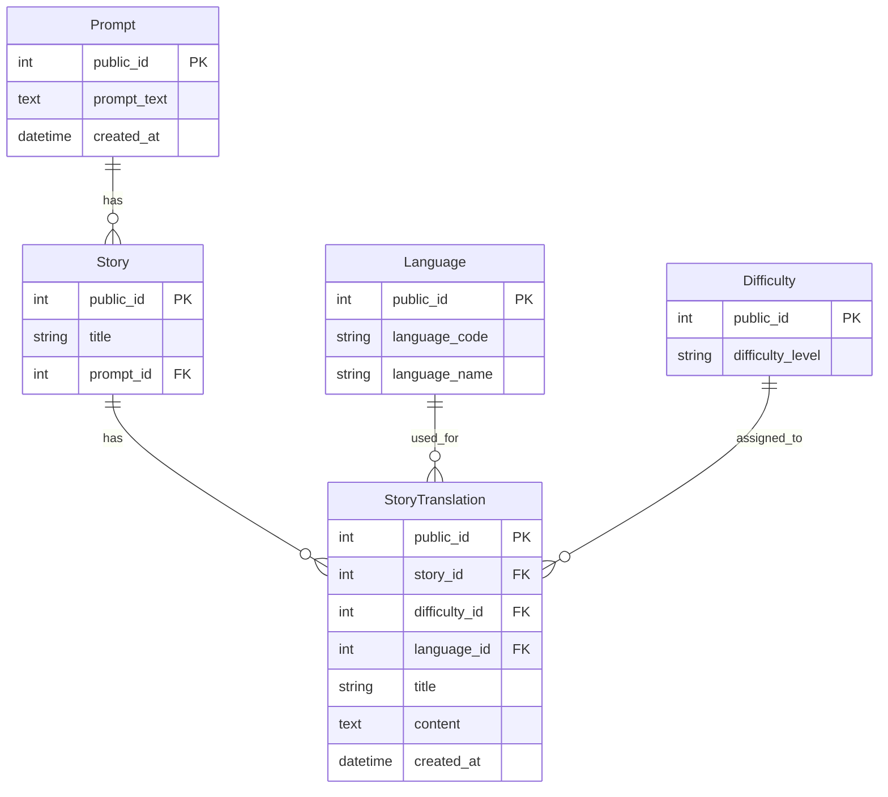

```mermaid
erDiagram
    Language {
        int public_id PK
        string language_code
        string language_name
    }

    Difficulty {
        int public_id PK
        string difficulty_level
    }

    Prompt {
        int public_id PK
        text prompt_text
        datetime created_at
    }

    Story {
        int public_id PK
        string title
        int prompt_id FK
    }

    StoryTranslation {
        int public_id PK
        int story_id FK
        int difficulty_id FK
        int language_id FK
        string title
        text content
        datetime created_at
    }

    Prompt ||--o{ Story : has
    Story ||--o{ StoryTranslation : has
    Language ||--o{ StoryTranslation : used_for
    Difficulty ||--o{ StoryTranslation : assigned_to
```